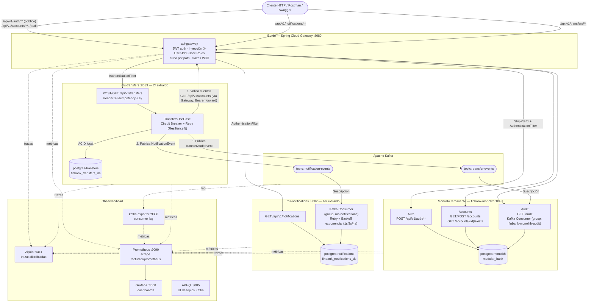

# FinBank — Migración a Microservicios

Modernización progresiva del monolito modular **FinBank** hacia una arquitectura de
microservicios, aplicando **Strangler Fig**, comunicación **asíncrona vía Kafka**,
patrones de **resiliencia** (Circuit Breaker, Retry, Idempotency) y un stack completo
de **observabilidad** (trazas, métricas y logs).

> El detalle de cada decisión (contexto, alternativas evaluadas, trade-offs) está en el
> [registro de ADR](docs/adr/0002-decisiones-arquitectura-microservicios.md) y en el
> [ADR de observabilidad](docs/adr/0001-observability-stack.md).

## Tabla de contenido

- [Arquitectura implementada](#arquitectura-implementada)
- [Diagrama general del proyecto](#diagrama-general-del-proyecto)
- [Servicios, puertos y bases de datos](#servicios-puertos-y-bases-de-datos)
- [Requisitos previos](#requisitos-previos)
- [Cómo levantar el proyecto](#cómo-levantar-el-proyecto)
- [Verificar que todo está arriba](#verificar-que-todo-está-arriba)
- [Flujo de prueba end-to-end](#flujo-de-prueba-end-to-end)
- [Observabilidad](#observabilidad)
- [Patrones de resiliencia y contratos de eventos](#patrones-de-resiliencia-y-contratos-de-eventos)
- [Estructura del repositorio](#estructura-del-repositorio)
- [Documentación adicional](#documentación-adicional)

## Arquitectura implementada

FinBank partía de un **monolito modular** (Auth, Accounts, Transfers, Notifications,
Audit) con schemas separados pero una única base de datos y comunicación in-process.
Se aplicó **Strangler Fig** en dos cortes sucesivos, dejando Auth/Accounts/Audit como
el **core remanente** en el monolito (alto riesgo transaccional, no se extraen) y
sacando dos dominios periféricos y de alta tasa de cambio:

| Orden | Módulo extraído | Microservicio      | Razón principal                                                                                                                                                                                                      |
| ----- | --------------- | ------------------ | -------------------------------------------------------------------------------------------------------------------------------------------------------------------------------------------------------------------- |
| 1     | Notificaciones  | `ms-notifications` | Bajo riesgo, dominio autónomo, tolerante a consistencia eventual — valida la infraestructura de eventos sin arriesgar el core bancario ([ADR-001](docs/adr/0002-decisiones-arquitectura-microservicios.md#adr-001)). |
| 2     | Transferencias  | `ms-transfers`     | Alta carga transaccional y necesidad de escalar horizontalmente, aislado de fallos del resto del sistema ([ADR-002](docs/adr/0002-decisiones-arquitectura-microservicios.md#adr-002)).                               |

**Decisiones clave** (detalle completo en el [registro de ADR](docs/adr/0002-decisiones-arquitectura-microservicios.md)):

- **API Gateway — Spring Cloud Gateway** ([ADR-003](docs/adr/0002-decisiones-arquitectura-microservicios.md#adr-003)): punto único de entrada, valida JWT,
  inyecta `X-User-Id`/`X-User-Roles` y enruta por _path_ al monolito o a los microservicios.
- **Broker de eventos — Apache Kafka** ([ADR-004](docs/adr/0002-decisiones-arquitectura-microservicios.md#adr-004)): persistencia por commit-log, orden por
  partición y _consumer groups_ para escalar el consumo de forma independiente.
- **Database-per-Service — PostgreSQL 15** ([ADR-005](docs/adr/0002-decisiones-arquitectura-microservicios.md#adr-005) / [ADR-006](docs/adr/0002-decisiones-arquitectura-microservicios.md#adr-006)): `ms-notifications` y
  `ms-transfers` tienen cada uno su propia base, aislada de `postgres-monolith`.
- **Consistencia distribuida — Saga coreografiada + Idempotencia** ([ADR-007](docs/adr/0002-decisiones-arquitectura-microservicios.md#adr-007)): al no poder
  usar una transacción ACID entre servicios, `ms-transfers` persiste localmente y publica
  eventos; cada consumidor aplica su propio efecto. La cabecera `X-Idempotency-Key` evita
  doble procesamiento ante reintentos del cliente.
- **Arquitectura interna por capas guiada por DDD** ([ADR-008](docs/adr/0002-decisiones-arquitectura-microservicios.md#adr-008)): `controller → service /
usecase → repository / event publisher`, con adaptadores de salida HTTP y Kafka en
  `ms-transfers` (estilo hexagonal ligero).
- **Observabilidad — Micrometer Tracing (Brave) + Zipkin + Prometheus + Grafana**
  ([ADR-009](docs/adr/0002-decisiones-arquitectura-microservicios.md#adr-009); detalle técnico en [ADR-0001](docs/adr/0001-observability-stack.md)): trazas
  distribuidas con propagación W3C tanto en HTTP como en las cabeceras de Kafka.
- **Contrato de eventos — JSON plano por DTO, versionado por ruta/topic** ([ADR-010](docs/adr/0002-decisiones-arquitectura-microservicios.md#adr-010)):
  `TransferEvent` / `NotificationEvent` serializados directo con Jackson, sin _envelope_
  genérico.
- **Migraciones — Flyway + Expand-and-Contract** ([ADR-011](docs/adr/0002-decisiones-arquitectura-microservicios.md#adr-011)): cada servicio migra su propio
  schema en el arranque, sin `ddl-auto=update` en producción.

**Qué no se extrajo y por qué:** Auth, Accounts y Audit permanecen en el monolito por ser
el _core_ transaccional del banco (saldo, identidad de cuentas). `ms-transfers` los trata
como **fuente única de verdad**, validándolos de forma síncrona vía HTTP (a través del
Gateway) antes de aceptar una transferencia.

## Diagrama general del proyecto



**Cómo leer el diagrama:** las flechas sólidas son llamadas síncronas (HTTP); las
punteadas hacia `Obs` son la instrumentación de observabilidad (trazas/métricas), que
corre en paralelo sin bloquear el flujo de negocio. Los topics de Kafka desacoplan
temporalmente a `ms-transfers` de sus dos consumidores — si `ms-notifications` está
caído, la transferencia y la auditoría no se ven afectadas.

Diagramas adicionales (dependencias entre módulos del monolito, happy path vs failure
path, aislamiento de schemas) están en [`finbank-monolith/README.md`](finbank-monolith/README.md).
El detalle de secuencia de cada petición (auth, cuentas, transferencia paso a paso,
reintentos de idempotencia, Circuit Breaker, consumidor Kafka con backoff y lecturas) está
en [`docs/diagrams/flujos-de-peticiones.md`](docs/diagrams/flujos-de-peticiones.md).

## Servicios, puertos y bases de datos

| Servicio           | Puerto  | Rol                                           | Base de datos                                                |
| ------------------ | ------- | --------------------------------------------- | ------------------------------------------------------------ |
| `api-gateway`      | 8080    | Punto de entrada único, JWT, ruteo            | —                                                            |
| `finbank-monolith` | 8081    | Auth, Accounts, Audit (core remanente)        | `postgres-monolith` (5432) → `modular_bank`                  |
| `ms-notifications` | 8082    | Notificaciones (1er extraído)                 | `postgres-notifications` (5433) → `finbank_notifications_db` |
| `ms-transfers`     | 8083    | Transferencias (2º extraído)                  | `postgres-transfers` (5434) → `finbank_transfers_db`         |
| `kafka`            | 9092    | Broker de eventos (Confluent 7.5.0)           | —                                                            |
| `zookeeper`        | interno | Coordinación de Kafka                         | —                                                            |
| `akhq`             | 8085    | UI para inspeccionar topics/mensajes de Kafka | —                                                            |
| `zipkin`           | 9411    | Backend de trazas distribuidas                | —                                                            |
| `prometheus`       | 9090    | Scraping de métricas                          | —                                                            |
| `grafana`          | 3000    | Dashboards (admin/admin)                      | —                                                            |
| `kafka-exporter`   | 9308    | Métrica de consumer lag por topic/grupo       | —                                                            |

Topics de Kafka: `notification-events` (productor `ms-transfers`, consumidor
`ms-notifications`) y `transfer-events` (productor `ms-transfers`, consumidor
`finbank-monolith`, grupo `finbank-monolith-audit`).

## Requisitos previos

- Docker y Docker Compose
- Java 17+ y Maven 3.9+ (solo si se quiere compilar/ejecutar un servicio fuera de Docker)
- Un cliente HTTP (Postman, curl) para probar los endpoints

## Cómo levantar el proyecto

Todo el stack (monolito, microservicios, Kafka, Postgres x3 y observabilidad) se levanta
con un único `docker-compose.yml` en la raíz del repositorio:

```bash
# Desde la raíz del proyecto
docker-compose up -d --build
```

Esto construye las 4 imágenes Java (`api-gateway`, `finbank-monolith`,
`ms-notifications`, `ms-transfers`) con Maven multi-stage y levanta el resto de
contenedores de infraestructura. El orden de arranque está resuelto con `depends_on` +
`healthcheck` (Postgres y Kafka deben estar `healthy` antes de que arranque el servicio
que los consume).

Variables de entorno relevantes (todas tienen un valor por defecto en
`docker-compose.yml`, solo hace falta sobreescribirlas si se cambia algo):

| Variable                                                     | Usado por                             | Default                                               |
| ------------------------------------------------------------ | ------------------------------------- | ----------------------------------------------------- |
| `JWT_SECRET`                                                 | `api-gateway`                         | `modular-bank-dev-secret-change-in-production-256bit` |
| `SPRING_KAFKA_BOOTSTRAP_SERVERS`                             | los 3 servicios Java                  | `kafka:29092`                                         |
| `MANAGEMENT_ZIPKIN_TRACING_ENDPOINT`                         | los 4 servicios                       | `http://zipkin:9411/api/v2/spans`                     |
| `MONOLITH_URI` / `MS_NOTIFICATIONS_URI` / `MS_TRANSFERS_URI` | `api-gateway`                         | `http://<servicio>:<puerto>`                          |
| `GATEWAY_URI`                                                | `ms-transfers` (para validar cuentas) | `http://api-gateway:8080`                             |

Para apagar todo (conservando los volúmenes de datos):

```bash
docker-compose down
```

Para reiniciar desde cero (borra los datos de Postgres):

```bash
docker-compose down -v
```

### Ejecutar un servicio individual fuera de Docker (desarrollo)

Con la infraestructura (`postgres-*`, `kafka`, `zipkin`, `prometheus`, `grafana`) ya
levantada por `docker-compose`, cualquier servicio Java puede correrse en local:

```bash
cd ms-transfers   # o finbank-monolith / ms-notifications / api-gateway
mvn spring-boot:run
```

## Verificar que todo está arriba

```bash
docker ps --format "table {{.Names}}\t{{.Status}}"

curl http://localhost:8080/api/v1/auth/login -i        # api-gateway (405 esperado en GET, confirma que responde)
curl http://localhost:8081/actuator/health              # finbank-monolith
curl http://localhost:8082/actuator/health              # ms-notifications
curl http://localhost:8083/actuator/health              # ms-transfers
```

Swagger/OpenAPI unificado, servido por el propio Gateway: `http://localhost:8080/swagger-ui.html`.

## Flujo de prueba end-to-end

Todo el tráfico de negocio pasa por el Gateway (`http://localhost:8080`).

**1. Registrar y autenticar un usuario**

```bash
curl -X POST http://localhost:8080/api/v1/auth/register \
  -H "Content-Type: application/json" \
  -d '{"email":"demo@finbank.com","password":"demo12345","name":"Demo User"}'

curl -X POST http://localhost:8080/api/v1/auth/login \
  -H "Content-Type: application/json" \
  -d '{"email":"demo@finbank.com","password":"demo12345"}'
# -> { "accessToken": "...", "refreshToken": "..." }
```

**2. Crear dos cuentas** (origen y destino) con el `accessToken` recibido:

```bash
TOKEN="<accessToken>"
curl -X POST http://localhost:8080/api/v1/accounts -H "Authorization: Bearer $TOKEN"
curl -X POST http://localhost:8080/api/v1/accounts -H "Authorization: Bearer $TOKEN"
```

**3. Ejecutar una transferencia** (con clave de idempotencia):

```bash
curl -X POST http://localhost:8080/api/v1/transfers \
  -H "Authorization: Bearer $TOKEN" \
  -H "Content-Type: application/json" \
  -H "X-Idempotency-Key: demo-001" \
  -d '{
    "sourceAccountId": "<uuid-origen>",
    "targetAccountId": "<uuid-destino>",
    "amount": 100,
    "reference": "Prueba end-to-end"
  }'
```

Reenviar el mismo cuerpo con el mismo `X-Idempotency-Key` devuelve la transferencia ya
creada (mismo `id` y `createdAt`) en vez de duplicarla.

**4. Verificar los efectos asíncronos:**

```bash
curl http://localhost:8080/api/v1/notifications -H "Authorization: Bearer $TOKEN"   # ms-notifications
curl http://localhost:8080/api/v1/audit -H "Authorization: Bearer $TOKEN"            # audit (monolito)
```

## Observabilidad

### Trazas distribuidas — Zipkin

`http://localhost:9411`

Buscar por `serviceName = api-gateway` para ver la traza completa de un `POST
/api/v1/transfers`: `api-gateway → ms-transfers → finbank-monolith (validación de
cuentas) → Kafka (publish) → ms-notifications / finbank-monolith (consume)`, todo bajo
el mismo `traceId` gracias a la propagación W3C (`traceparent`) tanto en HTTP como en
las cabeceras de los mensajes de Kafka.

### Métricas — Prometheus + Grafana

- Prometheus: `http://localhost:9090` — scrapea `/actuator/prometheus` de los 4
  servicios Java cada 10s (config en [`observability/prometheus/prometheus.yml`](observability/prometheus/prometheus.yml)).
- Grafana: `http://localhost:3000` (usuario `admin` / password `admin`, o acceso
  anónimo habilitado como Admin) — el datasource de Prometheus se provisiona
  automáticamente ([`observability/grafana/provisioning`](observability/grafana/provisioning)).
  Importar el dashboard **"Spring Boot 3.x Statistics"** para ver uptime, heap, CPU,
  HikariCP y latencias HTTP por servicio.

Consultas útiles en Prometheus:

```promql
rate(http_server_requests_seconds_count[1m])          # throughput por endpoint
http_server_requests_seconds_sum                       # latencia acumulada
jvm_memory_used_bytes                                   # salud de la JVM
kafka_consumergroup_lag                                 # lag por consumer group / topic
```

### Kafka — AKHQ y consumer lag

- AKHQ (UI de topics): `http://localhost:8085` — inspeccionar los mensajes de
  `notification-events` y `transfer-events`, sus particiones y consumer groups.
- `kafka-exporter` expone `kafka_consumergroup_lag` en `http://localhost:9308/metrics`,
  scrapeado por Prometheus. Un lag en `0` confirma que `ms-notifications` y
  `finbank-monolith-audit` están consumiendo en tiempo real.

## Patrones de resiliencia y contratos de eventos

| Patrón                                  | Dónde                                                                   | Mecanismo                                                                                                                                                               |
| --------------------------------------- | ----------------------------------------------------------------------- | ----------------------------------------------------------------------------------------------------------------------------------------------------------------------- |
| **Idempotency Key**                     | `ms-transfers`, header `X-Idempotency-Key`                              | Constraint único en BD; una clave repetida devuelve el registro existente sin reprocesar ni republicar eventos.                                                         |
| **Circuit Breaker**                     | `ms-transfers` → validación de cuentas contra el monolito (vía Gateway) | Resilience4j, ventana de 10 llamadas, umbral de fallo 50%, `wait-duration-in-open-state: 10s`. Al abrirse, responde `503` en modo _fail-fast_ (~17ms) sin agotar hilos. |
| **Retry con backoff exponencial**       | Mismo cliente HTTP de cuentas                                           | 4 intentos (1 inicial + 3 reintentos), backoff `1s → 2s → 4s`, compuesto para que los 3 reintentos cuenten como un solo resultado ante el Circuit Breaker.              |
| **Retry + backoff en consumidor Kafka** | `ms-notifications`, `@KafkaListener` de `notification-events`           | `DefaultErrorHandler` + `ExponentialBackOff` (1s/2s/4s, máx. 3 reintentos); tras agotarlos, descarta el mensaje y avanza el offset dejando log de auditoría.            |
| **Saga coreografiada**                  | `ms-transfers` → Kafka → `ms-notifications` / `finbank-monolith`        | Sin 2PC: la transferencia se confirma localmente y los efectos secundarios (notificar, auditar) ocurren de forma asíncrona y eventualmente consistente.                 |

Contrato de eventos (JSON plano, sin _envelope_, versionado por topic/ruta):

| Evento               | Topic                 | Productor      | Consumidor(es)             | Propósito                                              |
| -------------------- | --------------------- | -------------- | -------------------------- | ------------------------------------------------------ |
| `NotificationEvent`  | `notification-events` | `ms-transfers` | `ms-notifications`         | Notificar al usuario la transferencia completada.      |
| `TransferAuditEvent` | `transfer-events`     | `ms-transfers` | `finbank-monolith` (Audit) | Registrar la traza contable/histórica de la operación. |

## Estructura del repositorio

```
fintech-core-modernization/
├── api-gateway/          # Spring Cloud Gateway — JWT, ruteo, OpenAPI unificado
├── finbank-monolith/     # Monolito remanente: Auth, Accounts, Audit
├── ms-notifications/     # 1er microservicio extraído (Strangler Fig)
├── ms-transfers/         # 2º microservicio extraído (Strangler Fig)
├── observability/
│   ├── grafana/provisioning/   # Datasource de Prometheus autoprovisionado
│   └── prometheus/prometheus.yml
├── docs/adr/             # Registro de decisiones de arquitectura (ADR)
└── docker-compose.yml    # Orquesta todo el stack (apps + infra + observabilidad)
```

## Documentación adicional

- [`docs/adr/0002-decisiones-arquitectura-microservicios.md`](docs/adr/0002-decisiones-arquitectura-microservicios.md) —
  registro completo de ADR-001 a ADR-011 (contexto, opciones evaluadas, decisión y
  consecuencias de cada una de las 11 decisiones de arquitectura) y el análisis de
  trade-offs final (consistencia vs. disponibilidad, reversibilidad de las
  decisiones, módulos que se decidió no extraer).
- [`docs/adr/0001-observability-stack.md`](docs/adr/0001-observability-stack.md) —
  ADR técnico detallado del stack de trazas/métricas/logs (ADR-009).
- [`finbank-monolith/README.md`](finbank-monolith/README.md) — diagramas adicionales
  (dependencias entre módulos, happy path vs failure path, aislamiento de schemas por
  módulo dentro de `postgres-monolith`).
- [`docs/diagrams/flujos-de-peticiones.md`](docs/diagrams/flujos-de-peticiones.md) —
  diagramas de secuencia de los flujos de petición: autenticación, gestión de cuentas,
  transferencia paso a paso (validaciones e idempotencia), condición de carrera en
  idempotencia, Circuit Breaker + Retry con el timing real de Resilience4j, reintento y
  descarte en el consumidor Kafka de `ms-notifications`, y las consultas de lectura.
