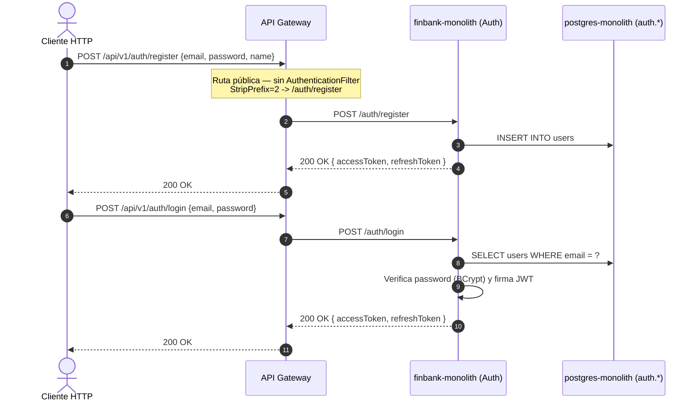
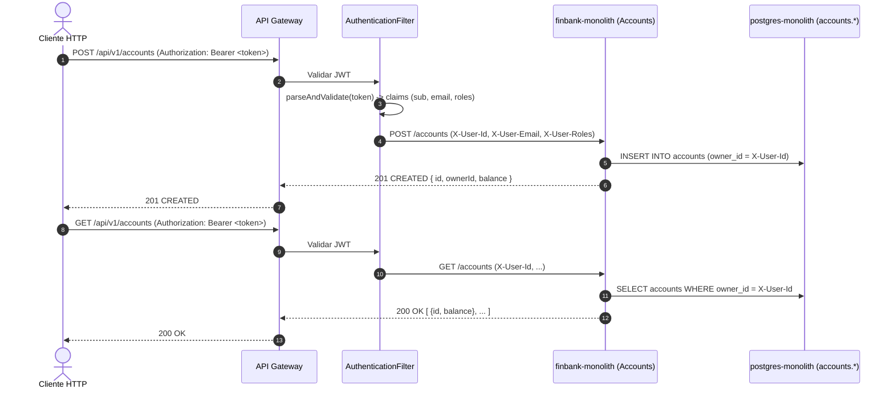
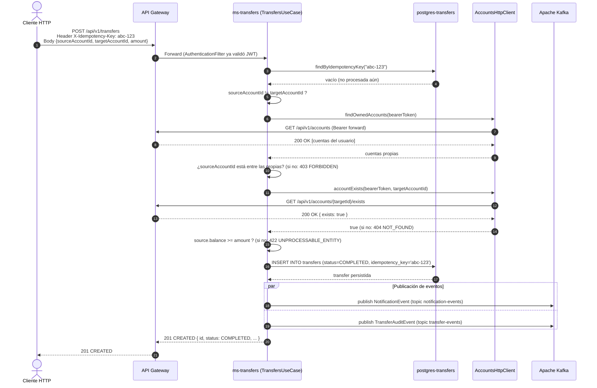
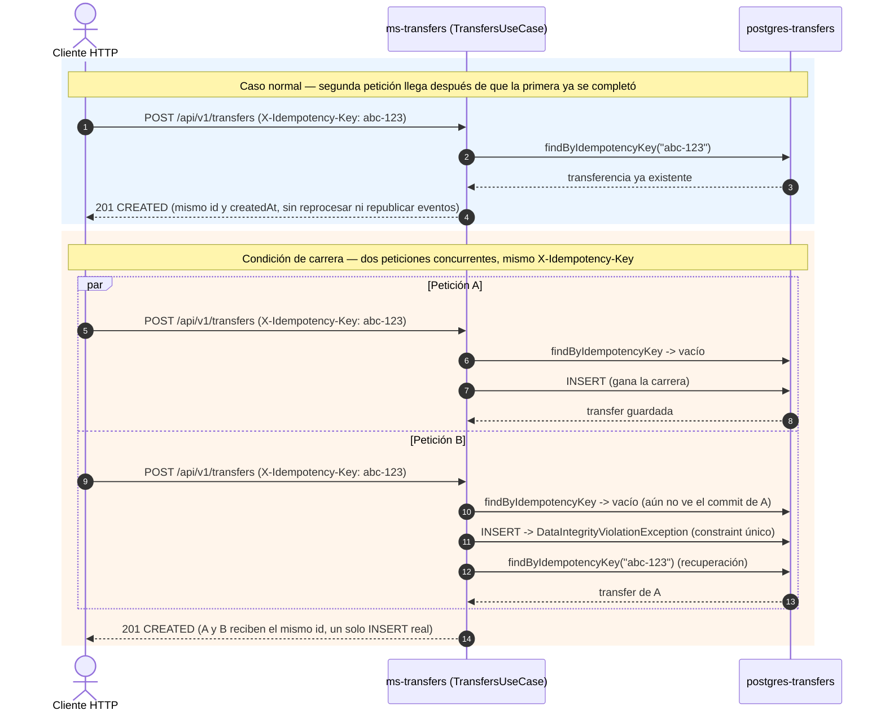
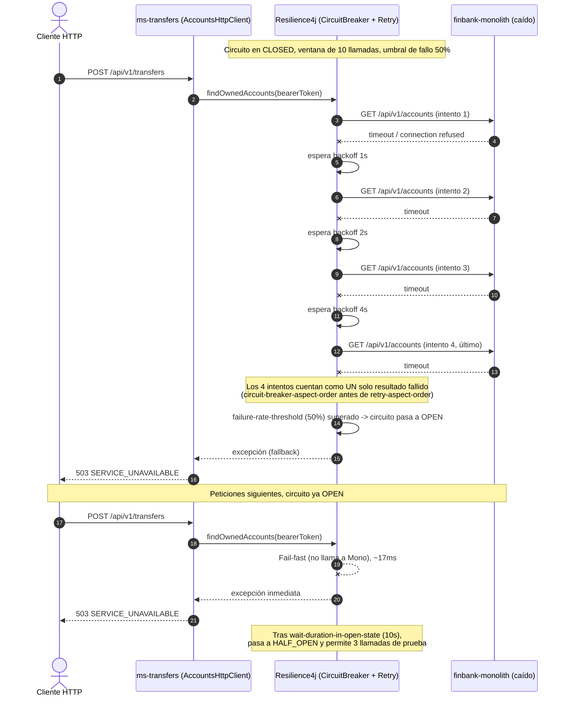
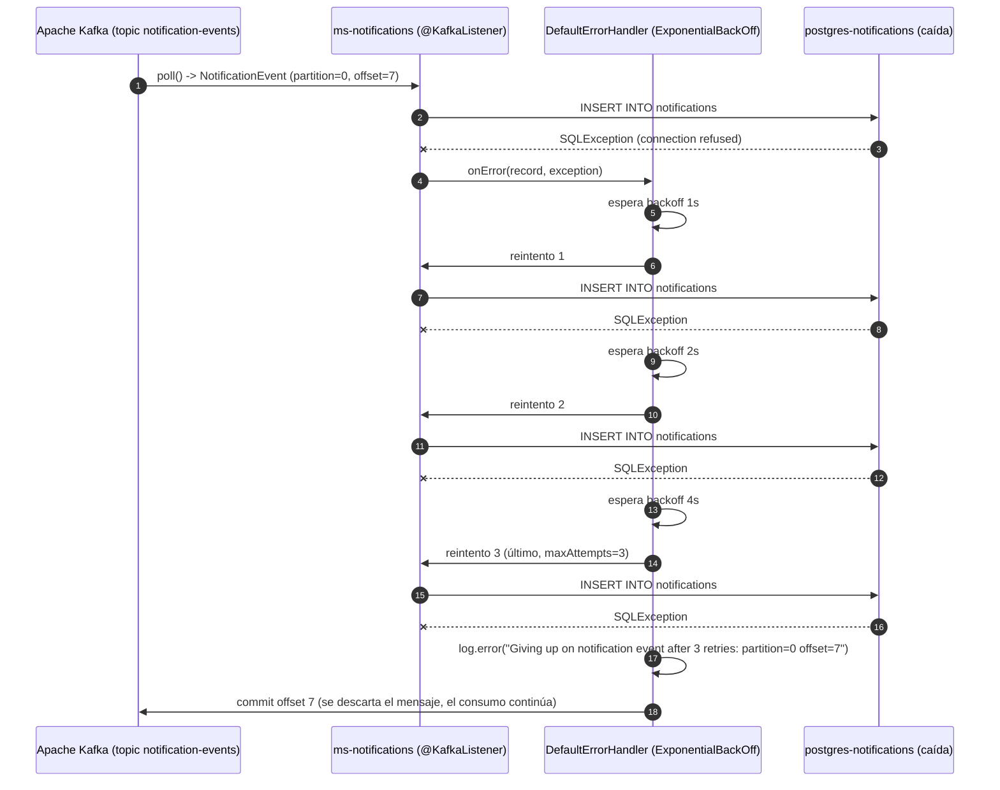
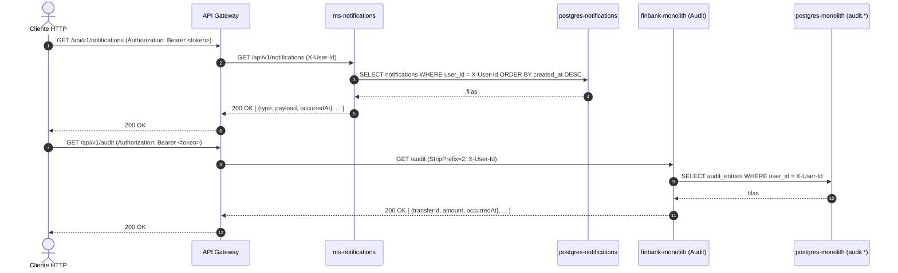

# Diagramas de secuencia — Flujos de petición

Este documento reúne los diagramas de secuencia de los flujos de petición más
relevantes del proyecto: los que atraviesan el `api-gateway`, el monolito remanente y
los dos microservicios extraídos (`ms-transfers`, `ms-notifications`), tanto por HTTP
como por Kafka. Complementa el [diagrama general](../../README.md#diagrama-general-del-proyecto)
del README raíz (que muestra la topología estática) con la secuencia temporal de cada
caso de uso.

> - [Patrón de consistencia distribuida (Saga)](../../finbank-monolith/README.md#patron-de-consistencia-distribuida) — publicación y consumo paralelo de `NotificationEvent`/`TransferAuditEvent` tras crear una transferencia.
> - [Happy Path vs Failure Path](../../finbank-monolith/README.md#diagrama-de-secuencia-happy-path-vs-failure-path) — la misma transferencia con el Monolito caído, Circuit Breaker abierto y respuesta degradada.
>
> Los diagramas de abajo cubren el resto de flujos del sistema: autenticación, cuentas,
> el detalle interno de `TransfersUseCase` (idempotencia, validaciones, condición de
> carrera), el reintento del consumidor Kafka de `ms-notifications` y las consultas de
> lectura (notificaciones, auditoría).

## Tabla de contenido

- [1. Autenticación — Registro y Login](#1-autenticación--registro-y-login)
- [2. Gestión de cuentas — Crear y listar](#2-gestión-de-cuentas--crear-y-listar)
- [3. Transferencia — Happy path con validaciones e idempotencia](#3-transferencia--happy-path-con-validaciones-e-idempotencia)
- [4. Transferencia — Reintento con la misma clave de idempotencia](#4-transferencia--reintento-con-la-misma-clave-de-idempotencia)
- [5. Circuit Breaker + Retry ante caída del monolito](#5-circuit-breaker--retry-ante-caída-del-monolito)
- [6. Consumo de eventos en `ms-notifications` con reintento y descarte](#6-consumo-de-eventos-en-ms-notifications-con-reintento-y-descarte)
- [7. Consulta de notificaciones y auditoría (lectura)](#7-consulta-de-notificaciones-y-auditoría-lectura)

---

## 1. Autenticación — Registro y Login

`POST /api/v1/auth/register` y `POST /api/v1/auth/login` son las únicas rutas públicas:
el Gateway las enruta sin pasar por `AuthenticationFilter` (ver ruta `monolith-public-auth`
en [`api-gateway/src/main/resources/application.yml`](../../api-gateway/src/main/resources/application.yml)).

## 2. Gestión de cuentas — Crear y listar

Rutas protegidas del monolito (`monolith-protected-route`): pasan por
`AuthenticationFilter`, que valida el JWT y **propaga** `X-User-Id` / `X-User-Roles`
hacia el servicio downstream — el controlador nunca ve el token, solo el `userId` ya
resuelto.

## 3. Transferencia — Happy path con validaciones e idempotencia

Detalle interno de `TransfersUseCase.execute(...)` en `ms-transfers`: el orden real de
las validaciones (idempotencia → cuentas distintas → titularidad del origen →
existencia del destino → saldo) antes de persistir y publicar eventos. Complementa el
diagrama de Saga ya existente en `finbank-monolith/README.md`, mostrando qué pasa
_dentro_ de `ms-transfers` antes de que se publique cualquier evento.

> El consumo paralelo de esos dos eventos por `ms-notifications` y por el `AuditListener`
> del monolito está en el diagrama de Saga de
> [`finbank-monolith/README.md`](../../finbank-monolith/README.md#patron-de-consistencia-distribuida).

## 4. Transferencia — Reintento con la misma clave de idempotencia

Cubre los dos caminos por los que `ms-transfers` evita procesar dos veces la misma
operación: la relectura previa (caso normal) y la **condición de carrera** cuando dos
peticiones concurrentes llegan con la misma clave (resuelta por el índice único de
`idempotency_key` en `postgres-transfers`, ver `TransfersUseCase.doExecute`).

## 5. Circuit Breaker + Retry ante caída del monolito

Timing exacto de Resilience4j configurado en `ms-transfers`
([`application.yml`](../../ms-transfers/src/main/resources/application.yml)): 4 intentos
(1 inicial + 3 reintentos) con backoff `1s → 2s → 4s` sobre la llamada de validación de
cuentas, y apertura del circuito al superar 50% de fallos en una ventana de 10 llamadas.
El diagrama de alto nivel de este mismo flujo ya está en
[`finbank-monolith/README.md`](../../finbank-monolith/README.md#diagrama-de-secuencia-happy-path-vs-failure-path);
aquí se detalla la secuencia de reintentos que ese diagrama resume en un solo `loop`.

## 6. Consumo de eventos en `ms-notifications` con reintento y descarte

`KafkaConsumerConfig` en `ms-notifications` envuelve el `@KafkaListener` de
`notification-events` con un `DefaultErrorHandler` + `ExponentialBackOff` (1s, 2s, 4s;
máximo 3 reintentos). Si la causa del fallo no se resuelve (p. ej. la base de datos
sigue caída), el mensaje se descarta y el offset avanza — no hay una DLQ configurada en
este incremento, solo el log de auditoría del _recoverer_.

## 7. Consulta de notificaciones y auditoría (lectura)

Ambas rutas son de solo lectura, filtradas siempre por el usuario autenticado
(`X-User-Id` inyectado por el Gateway) — ningún endpoint permite leer datos de otro
usuario.

